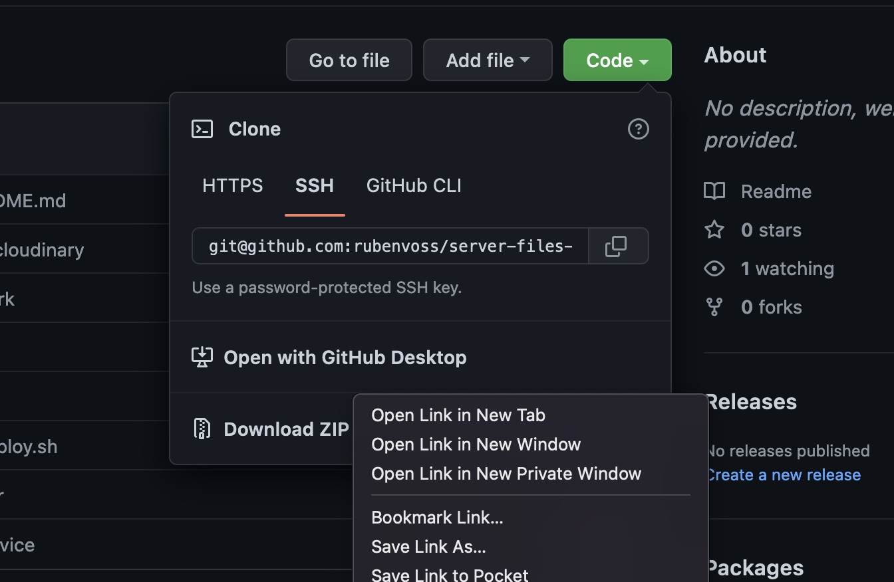

# Setup your server
On AWS, you have to launch an EC2 instance, set Debian as your OS, configure a security group that allows http traffic and SSH traffic and set a SSH keypair or a password to login.

## Security Group
On AWS, make a security policy and expose ports 22 for SSH, 80 for HTTP and Port 9000 as a Custom TCP (source 0.0.0.0/0)

<br>


Once it is launched, login with SSH and use admin as a user:
```
ssh admin@123.456.78.0
```
Add your server to your known hosts.
After that, your server will ask you for your password. Copy it from your Hosting Provider.
Now you should be logged in, and the last line should be something like this:
```
admin@v2202209103428200491:~#
```

## Change your password
Do this if you don't use a SSH keypair:
After logging in the first time, you should set up a new secure password, that **only you** know.
type in to your command line:
```
passwd
```

# Install everything you need to your server with this script:
Fork this repo:
```
https://github.com/rubenvoss/server-files-debian-11
```
## 1. Adjust the docker-compose.yml file to match your docker compose setup
<br>

## 2. In the nginx.conf file, add your domain after server_name
<br>

## 3. Adjust the redeploy.sh with the commands you need. Right now it executes a docker compose up, after getting a new commit on the main/master branch on Github
<br>

## 4. Go to the code buttonn on your Fork in GitHub & right-click the Download ZIP to get the link

<br>

## 5. Download your forked repo to your servers home folder & unzip it
```
cd ~
sudo apt update
sudo apt install unzip wget -y
```
Download your repo
```
wget YOUR_REPO_LINK
```
```
unzip main.zip
```
<br>

## 6. Rename it server_files
```
sudo mv YOUR_REPOS_FOLDER_NAME/ server_files/
```
<br>

## 7. Now, give the script permissions:
```
sudo chmod +x server_files/setup_debian_11.sh
```
<br>

## 8. Execute the script:
This can take some time. Your server will reboot after the script is finished & you will have to ssh into it again.
```
server_files/setup_debian_11.sh
```
<br>

## 9. Check if stuff was installed:
```
# check for the status of nginx - should be active
systemctl status nginx
# check for webhook - should be active
systemctl status webhook
# check for docker - should download and run a container
docker run hello-world
```
login with dockerhub
```
docker login
```
<br>

## 10. Copy your Rails credential keys to the server
The're in the config folder of your rails project, we have a Volume in the docker compose that's mirroring that config folder into your Docker container. Put them into a 'keys' folder on you server. This is like a better .env file with version control that you can share. [Here's an Article about rails credentials](https://kirillshevch.medium.com/encrypted-secrets-credentials-in-rails-6-rails-5-1-5-2-f470accd62fc)
```
exit
scp -r ~/code/keys/keys/ admin@18.192.54.84:~
```
move them out of the homefolder
```
ssh -i /Users/ruben/code/keys/rubenvoss.com.pem admin@123.456.789
sudo cp -r keys/ /opt/webhook/
```
